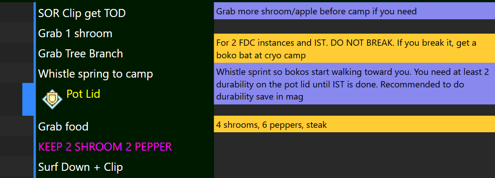

# Document
As the most important functionality of Celer, the Document and Map panels are tightly integrated to give the best experience for viewing routes.

## Main and Notes columns
The document is divided into 2 columns: the main column and the notes column.
The main column aims to provide short instructions for steps to execute, and the notes
provide longer explanations and things to pay attention to.

## Counter, Line Indicator and Color
On the left of the main column is the "head" of the line. The head can have 3 functionalities:

1. Display the color of the corresponding line on the map. If the line is the "current line", the color indicator expands to a colored block.
2. Some lines can have a tag block to its left. This is usually used as counters for objectives.
3. Clicking on the line head will make that line the "current line". The map will center to that location.

## Note Positions
Each note block is meant for a specific line. Celer tries its best to display note blocks
aligned to the line it is supposed to be for. When this causes overlap with other elements like
other notes or section headers, the notes are free to shift around so they don't overlap.
:::tip
If this behavior is undesirable, you can make the notes always aligned to the main column lines
in the document settings.
:::

If the window size is too small, the notes may be ellipsisized. You can hover on it (tap it for touch screen) to expand the notes.

## Themes
:::info
The themes system is under construction. There will be a detailed guide on how to make your own theme.
This is tracked by issue [#125](https://github.com/Pistonite/celer/issues/125)
:::

The document viewer can be customized with themes. Celer comes with 2 themes: Default and Granatus.
You can also use custom CSS to override the themes, or suggest a new theme with a PR.

To switch between themes:
1. Click on <FluentIcon name="Settings20Regular" /> `Settings`.
2. Select the <FluentIcon name="Document20Regular" /> `Document` category.
3. Under `Appearance`, change `Theme` to the one you want.

The default themes have gone through validations to make sure they look good in both light and dark themes.

## Keyboard Control
The document also allows using the keyboard to move the current line up or down.

To configure the key bindings:
1. Click on <FluentIcon name="Settings20Regular" /> `Settings`.
2. Select the <FluentIcon name="Document20Regular" /> `Document` category.
3. Under `Keyboard control`, click on the key you want to change, then press and hold the key(s) you want to use.
:::warning
Some keys like `Up` and `Down` conflicts with the browser's default behavior to scroll up and down. By default, Celer binds the keys to
`Alt + Up` and `Alt + Down` to avoid this issue. You can also bind the keys to something that doesn't conflict, for example, `J` and `K`
:::

## Splits
The split setting allow you to choose where you want to split for the "Previous/Next Split" keyboard action
and when exporting splits.

To configure the splits, first load a document, then:
1. Click on <FluentIcon name="Settings20Regular" /> `Settings`.
2. Select the <FluentIcon name="Document20Regular" /> `Document` category.
3. Under `Splits`, check the places you want to split
4. Clicking `Reset split types` will reset the setting to what's provided by the document.
:::tip
The split types are defined in the document. If you don't see any checkboxes, contact the author of the route.
:::

## Sync Map to Doc
By default, the map will automatically change its view after scrolling on the document so that all the lines visible in the document are also
visible in the map. You can turn this off in the settings.
