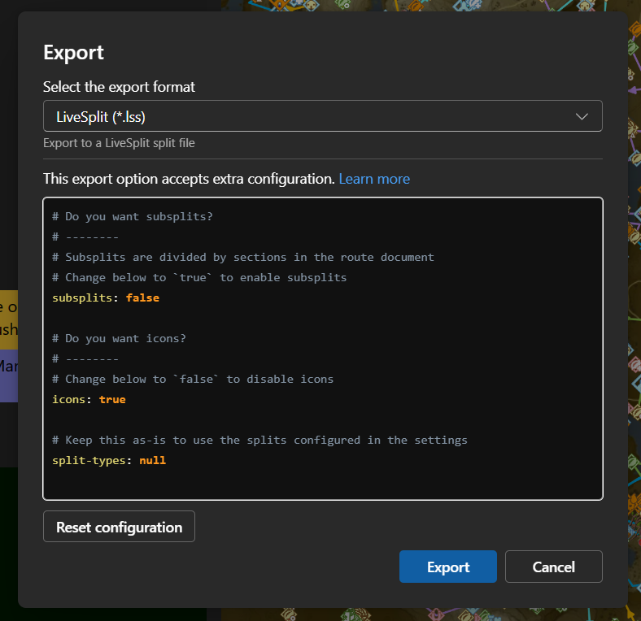

# Export
Celer makes the data from the document easily accessible through its [Exporter Plugins](./plugin/getting-started.md).

## Configure Exporter Plugins
Here is an example of how to enable the plugins to export split files for speedrunning.

1. Click on <FluentIcon name="Settings20Regular" /> `Settings`.
2. Select the <FluentIcon name="Wrench20Regular" /> `Plugins` category.
3. Under `App Plugins`, make sure `Export split files` is checked.

Exporters not pre-configured by Celer needs to be either loaded in the route
or configured through user plugins. You can read more [here](./plugin/settings.md).

## Export the Data
After the exporter is configured, they should show up in the <FluentIcon name="ArrowDownload20Regular" /> `Export` menu in the toolbar.

Clicking on the export format and Celer will execute the exporter. The exported file will be automatically downloaded when finished.

## Extra Configuration
Some exporters support extra configurations before running. You will see an extra dialog like below:

The configuration is in [YAML](./route/yaml-basics.md) format. If the exporter provides documentation, clicking on the
"learn more" link will take you there.
