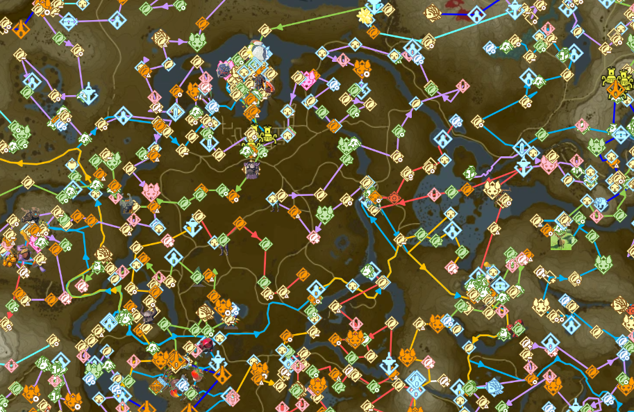

# Map
Celer uses [Leaflet](https://leafletjs.com) for the map.
The map displays icons and lines corresponding to the movements in the route.

:::info
Image taken from [this route](scheme://celer.placeholder.domain/view/Pistonight/celer-doc-fuzzing/omegeb)
:::

## Visuals
The map has 3 types of visuals:

1. Icons: Custom icons defined by the route to indicate objectives
2. Lines: Lines with arrows to indicate movements
3. Markers: Colored circular indicators.
You can adjust the Section Mode, Layer Mode and sizes of these visuals.

## Section Mode
Section mode is how a visual is displayed based on if it is in the current section being
viewed in the document. There are 4 modes:

|Section Mode|Description|
|-|-|
|All|Always show the visual|
|Highlight Current|Always show the visual, but grey it out if it's not in the current section|
|Current Section|Only show the visual if it is in the current section|
|None|Never show the visual|

You can adjust the Section Mode for icons, lines and markers separately by following these steps:
1. Click on <FluentIcon name="Settings20Regular"/> `Settings` on the Toolbar.
2. Select the <FluentIcon name="Map20Regular" /> `Map` category.
3. Under `Icons`, `Lines` or `Markers`, find `Section mode`.
4. Select the mode you want.

## Layer Mode
Layer mode is how a visual is displayed based on if it is in the current layer being viewed.
There are 3 modes:

:::tip
You can only change the Layer Mode if the Section Mode is not `None`.
:::

|Layer Mode|Description|
|-|-|
|Current Layer Only|Show only visuals on the current layer|
|Current and Adjacent Layers|Show only visuals on the current layer, plus icons on the layer above and below|
|All Layers|Show all visuals regardless of what the current layer is|

To change the Layer Mode:
1. Click on <FluentIcon name="Settings20Regular"/> `Settings` on the Toolbar.
2. Select the <FluentIcon name="Map20Regular" /> `Map` category.
3. Under `Icons`, `Lines` or `Markers`, find `Layer mode`.
4. Select the mode you want.

You can also change the `Fade icons not on current layer` switch. When this is on, visuals not on the current layer
will be displayed with transparency. You can only change this if the Layer mode is not `Current Only`.

## Sizes
You can also configure the sizes of each visuals in the map settings.

To change the visual sizes:
1. Click on <FluentIcon name="Settings20Regular"/> `Settings` on the Toolbar.
2. Select the <FluentIcon name="Map20Regular" /> `Map` category.
3. Under `Icons`, `Lines` or `Markers`, use the size sliders to change the sizes.

### Icons
Each route categorizes the icons into primary, secondary, and other. You can change the sizes between small, regular and large for each category.
You can also hide one category of icons completely by setting the size to Hidden.

### Lines
For lines, you can change the thickness, the size of the arrows, and the spacing of the arrows. You can also hide the arrows completely by setting the arrow size to hidden.

### Markers
For markers, you can change the size between hidden, small, regular and large.

## Interactions
The visuals on the map also provides interactions.
### Go to Line
When clicking on an icon or marker, the document will be scrolled to the line where that icon or marker is at.
