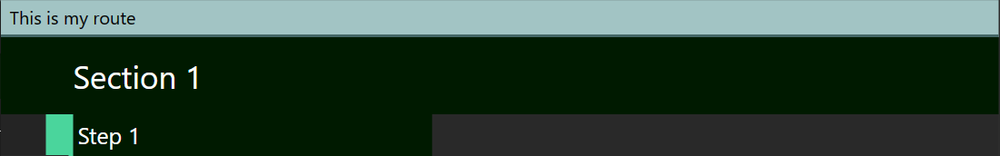

# Hello, World!
In this section, we will create a minimal working route in Celer using the [Editor](scheme://celer.placeholder.domain/edit).
:::tip
"Hello, World!" is the computer equivalent of a baby's first words. When someone's learning how to tell a computer what to do, which is what programming is all about, the first step is often to get the computer to say "Hello, World!" It's a way to make sure that everything is set up correctly before diving into more complex stuff. *-- ChatGPT*
:::

## Creating Files
The Web Editor currently does not support creating files. So we need to do that ourselves:

1. Create an empty folder on your PC.
2. Create 2 empty files called `project.yaml` and `main.yaml` inside that folder.
:::tip
The file names are case-sensitive. The file should be named `project.yaml`,
not `Project.yaml` or `project.yml`
:::

## Open Project
:::warning
Currently, you can only open a project using drag-and-drop. If you don't have a graphical file manager,
you currently cannot use the Web Editor. This issue is tracked by [#122](https://github.com/Pistonite/celer/issues/122)
:::
To open the project in the Web Editor:

1. Open the [Editor](scheme://celer.placeholder.domain/edit)
2. Drag and drop the folder from your PC to the drop box in the Web Editor

The project will compile with an error. Don't worry. That's because we haven't added any content yet!

## Add Project Detail
Open `project.yaml` and add the following content
```yaml
# The name of your project/route.
# This will be displayed in the header for people who are viewing your route
title: My Project

# The version of your route. There's no particular format here.
# This will be displayed in the metadata in the settings dialog
version: 1.0.0

# This is the route itself. Here it points to the main.yaml file we created earlier
route: 
  use: ./main.yaml

# Extra configuration.
# The project must define a map to compile properly.
# For now, we will use the Breath of the Wild celer map maintained by Pistonight
config:
- use: Pistonight/celer-presets/botw/map.yaml
```
Wait for a few seconds for the editor to pick up your changes, or press <FluentIcon name="Box20Regular"/> `Compile` on the Toolbar to compile manually.

Now you should see a slightly different error message. That's because we haven't added anything to `main.yaml`. Let's do that now.

## Add Route Detail
Open `main.yaml` and add the following content
```yaml
- This is my route
- Section 1:
  - Step 1
```

Wait for a few seconds for the editor to pick up your changes, or press <FluentIcon name="Box20Regular"/> `Compile` on the Toolbar to compile manually.

Now you should see the route document displayed. 

Congratulations! You made your first route in Celer!

