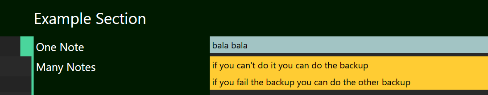
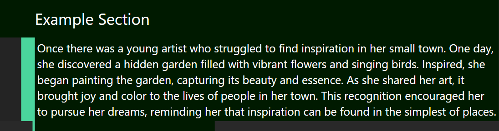

# Customizing Text and Notes
In the previous section, you have learned how the basic structures of a route works with Sections and Lines.

In this section, we will go through how to customize texts in the lines, such as adding secondary text (comments) and notes.

## Line Properties
Celer allows you to add extra properties to a line in this format:
```yaml
route:
- Section:
  - I am a line: # <- note the colon at the end
  # ^ note the line starts here
      comment: I am a property
    # ^ note the property should have 2 spaces after where the line starts
```
:::tip
You can reference all properties for lines [here](./property-reference.md).
:::

## Primary and Secondary Text
The `text` and `comment` property are used to specify primary and secondary text.
Primary text is the main content of a line, while secondary text appears below the primary text
in a smaller font.
```yaml
- Example Section:
  - Do the thing:
      comment: be fast

  # Below is equivalent as above, but using the `text` property
  # the "placeholder" gets replaced by the `text` property
  - placeholder:
      text: Do the thing
      comment: be fast
```


## Adding Notes
Primary and secondary text are meant for concise description of steps to execute.
However, detailed explanations are sometimes needed. You can use notes on the side
to add such explanations without cluttering up the main column.

```yaml
- Example Section:
  - One Note:
      notes: bala bala
  - Many Notes:
      notes:
      - if you can't do it you can do the backup
      - if you fail the backup you can do the other backup
```

:::tip
The note blocks automatically adjust their positions to avoid overlapping. See [here](/doc#note-positions) for more
details and how you can change the behavior
:::

## Banners
Sometimes you might have something that is a bit too long to fit in the main column, but
it's too important to leave it in the notes. You can use the `banner` property to extend
the main column to cover the note areas
```yaml
- Example Section:
  - This is a normal line
  - This is a banner line:
      banner: true
```
If the banner is too long, use the `text` property, so you can break it
into multiple lines without messing up the syntax:
```yaml
- banner: # "banner" here is a placeholder text
    text: Once there was a young artist who struggled
          to find inspiration in her small town. One 
          day, she discovered a hidden garden filled 
          with vibrant flowers and singing birds.
          Inspired, she began painting the garden, 
          capturing its beauty and essence. As she shared 
          her art, it brought joy and color to the lives
          of people in her town. This recognition
          encouraged her to pursue her dreams, reminding
          her that inspiration can be found in the simplest of places.
    banner: true
```

